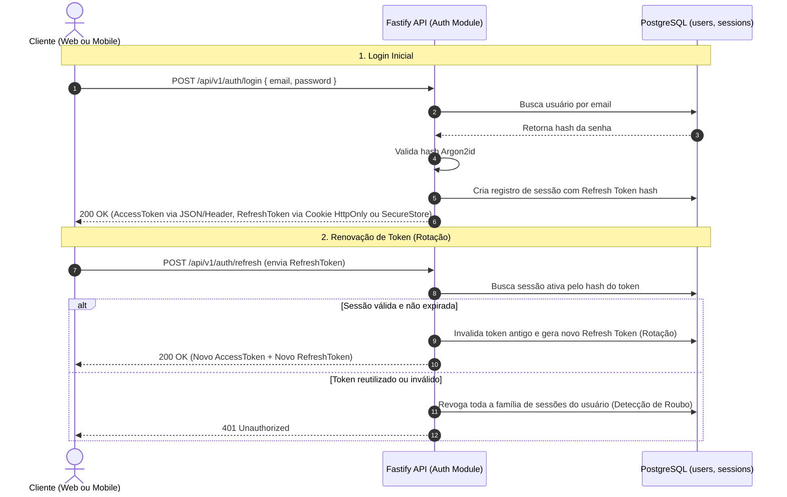
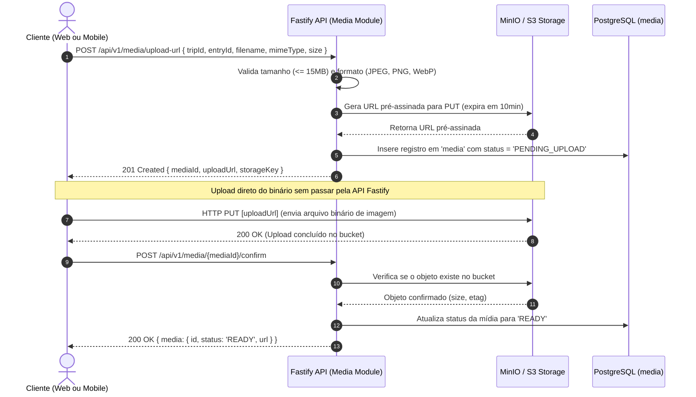
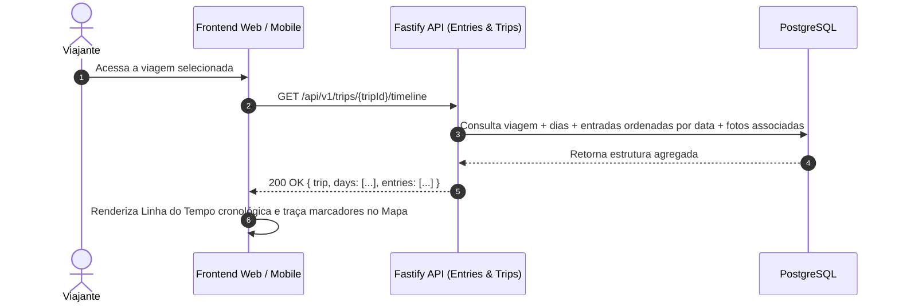
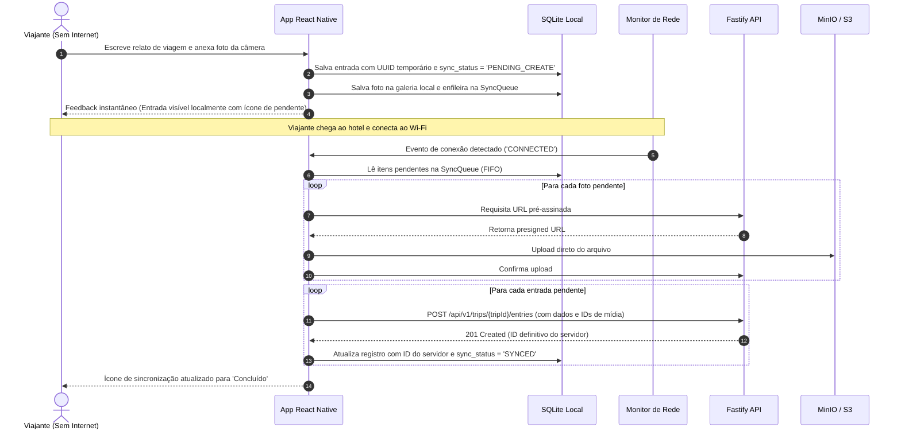

# Fluxos de Dados — Diário de Viagens

Este documento detalha os fluxos de dados ponta a ponta para as operações centrais do sistema, ilustrados com diagramas de sequência.

---

## 1. Fluxo de Autenticação e Rotação de Tokens

---

## 2. Fluxo de Upload Direto de Fotos (Presigned URLs)

Este fluxo garante que a API Fastify nunca processe buffers binários pesados de imagens, preservando CPU e memória da VPS.

---

## 3. Fluxo de Criação e Visualização de Linha do Tempo

---

## 4. Fluxo de Sincronização Mobile Offline-First

