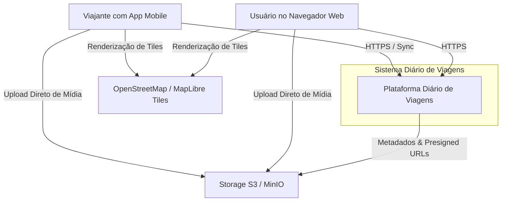

# Visão Geral da Arquitetura — Diário de Viagens

Este documento apresenta a arquitetura global do sistema **Diário de Viagens** utilizando a metodologia de modelagem **C4** (níveis de Contexto e Contêineres) e descreve como as partes interagem de forma eficiente.

---

## 1. Diagrama de Contexto do Sistema (C4 Level 1)

O sistema interage com usuários finais através de navegadores Web e dispositivos Mobile, além de serviços externos essenciais (tiles de mapas abertos e armazenamento compatível com S3).



---

## 2. Diagrama de Contêineres (C4 Level 2)

A topologia do sistema é otimizada para ser executada em um único servidor VPS de recursos limitados (1GB a 2GB de RAM), sem comprometer a escalabilidade futura.

```mermaid
graph TB
    subgraph Clients[Aplicações Clientes]
        WebClient["Frontend Web (Next.js 14+)<br/>[React, Tailwind CSS, TanStack Query]"]
        MobileClient["Aplicativo Mobile (React Native)<br/>[TypeScript, SQLite Local, Offline-First]"]
    end

    subgraph Infrastructure[Infraestrutura VPS (Docker Compose)]
        Proxy["Reverse Proxy (Caddy 2)<br/>[TLS Automático, Roteamento, Portas 80/443]"]
        
        API["Backend API (Fastify + TypeScript)<br/>[Modular Monolith, Pino, Zod Contracts]"]
        
        DB[("Banco de Dados Relacional<br/>[PostgreSQL 16 Alpine]")]
        
        Storage[("Object Storage S3-Compatible<br/>[MinIO Server]")]
        
        Redis[("Cache / Filas Opcional<br/>[Redis 7 Alpine - Desativado por padrão]")]
    end

    WebClient -->|HTTPS| Proxy
    MobileClient -->|HTTPS / REST API| Proxy
    
    Proxy -->|/api/* e /health| API
    Proxy -->|/* (Rotas Web)| WebClient
    
    API -->|Consultas SQL (Drizzle ORM)| DB
    API -->|Assinatura de URLs e Metadados| Storage
    API -.->|Opcional: Cache / Rate Limit| Redis
    
    WebClient -->|PUT Upload Direto de Fotos| Storage
    MobileClient -->|PUT Upload Direto de Fotos| Storage
```

---

## 3. Resumo dos Componentes

| Contêiner / Aplicação | Tecnologia | Responsabilidade Principal | Limite de RAM (VPS) |
| :--- | :--- | :--- | :--- |
| **Reverse Proxy** | Caddy 2.8 | TLS automático (Let's Encrypt), compressão zstd/gzip, cabeçalhos de segurança e roteamento | 64MB |
| **Backend API** | Fastify 5 + TS | Monólito Modular, autenticação, controle de viagens, regras de negócio e validação de contratos | 160MB |
| **Frontend Web** | Next.js 14+ | Interface de usuário para navegadores, dashboard, timeline interativa e mapa | 192MB |
| **Mobile App** | React Native | Aplicativo móvel para viajantes, câmera, diário rápido e sincronização offline-first | Executado no celular |
| **Banco de Dados** | PostgreSQL 16 | Armazenamento de usuários, sessões, viagens, entradas, locais e metadados de mídia | 256MB |
| **Object Storage** | MinIO | Armazenamento dos arquivos binários de fotos e miniaturas compatível com API S3 | 192MB |
| **Cache (Opcional)** | Redis 7 | Habilitado sob demanda para filas e rate limiting distribuído | 64MB |

**Consumo total de memória estático estimado**: ~450MB a 650MB em carga moderada, rodando tranquilamente em uma VPS de 1GB a 2GB.
