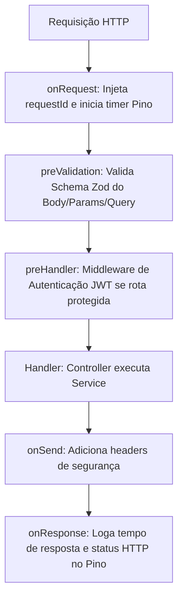

# Arquitetura do Backend — Diário de Viagens

Este documento detalha o design interno da API Fastify, o padrão de camadas, o ciclo de vida das requisições e as convenções de código adotadas.

---

## 1. Visão Geral e Estrutura de Pastas

O backend é construído com **Fastify 5** e **TypeScript**, organizado como um **Monólito Modular** estruturado em camadas bem delimitadas:

```text
apps/api/src/
├── app.ts                  # Configuração da instância do Fastify e plugins globais
├── server.ts               # Ponto de entrada (bootstrap e graceful shutdown)
│
├── core/                   # Utilitários compartilhados e infraestrutura base
│   ├── config/             # Validação de variáveis de ambiente com Zod
│   ├── database/           # Conexão PostgreSQL e instância do Drizzle ORM
│   ├── errors/             # Hierarquia de classes de erro de domínio
│   ├── storage/            # Contrato StorageProvider e S3StorageProvider
│   └── plugins/            # Plugins Fastify (errorHandler, auth, cors, rateLimit)
│
└── modules/                # Módulos de domínio de negócio isolados
    ├── auth/
    │   ├── auth.controller.ts
    │   ├── auth.service.ts
    │   ├── auth.repository.ts
    │   ├── auth.routes.ts
    │   └── index.ts        # Contrato público exportado pelo módulo
    ├── trips/
    ├── destinations/
    ├── entries/
    ├── locations/
    ├── media/
    └── sharing/
```

---

## 2. Separação de Camadas (*Layered Architecture*)

Cada módulo de domínio segue o padrão pragmático de 4 camadas:

```text
HTTP Request
     │
     ▼
[ Controller ]       → Trata protocolo HTTP, valida input (Zod), extrai params/headers e formata status de resposta
     │
     ▼
[ Service ]          → Contém as regras de negócio, orquestra fluxos e autorizações
     │
     ▼
[ Domain / Entity ]  → Define regras puras, validações invariantes e tipos do domínio
     │
     ▼
[ Repository ]       → Executa queries SQL puras via Drizzle ORM no PostgreSQL
     │
     ▼
[ Infrastructure ]   → Serviços externos (S3StorageProvider, drivers, sockets)
```

### Regras das Camadas:
1. **Controllers Não Contêm Regras de Negócio**: Um controller apenas mapeia DTOs HTTP para chamadas de serviço e retorna o código HTTP adequado (200, 201, 204).
2. **Services Não Conhecem HTTP**: Métodos de serviço não recebem `FastifyRequest` ou `FastifyReply`. Eles recebem parâmetros primitivos ou DTOs e retornam dados puros ou lançam exceções de domínio (`NotFoundError`, `ForbiddenError`).
3. **Repositories Isolam o SQL**: O Drizzle ORM é instanciado e acessado exclusivamente dentro dos repositórios. Se precisarmos mudar queries ou schemas, apenas os repositórios são alterados.

---

## 3. Ciclo de Vida da Requisição no Fastify



---

## 4. Gerenciamento de Dependências e Inicialização

Para evitar a sobrecarga de frameworks pesados de injeção de dependência (como `InversifyJS` ou `NestJS` que dependem de decoradores experimentais e reflection), adotamos **Injeção de Dependências por Parâmetro (Constructor/Factory)**.

Exemplo idiomático:
```typescript
// Instanciação limpa e explícita
const tripRepository = new TripRepository(db);
const tripService = new TripService(tripRepository, storageProvider);
const tripController = new TripController(tripService);
```

Isso torna a escrita de testes unitários extremamente rápida, permitindo injetar mocks e fakes sem complexidade de containers mágicos.
