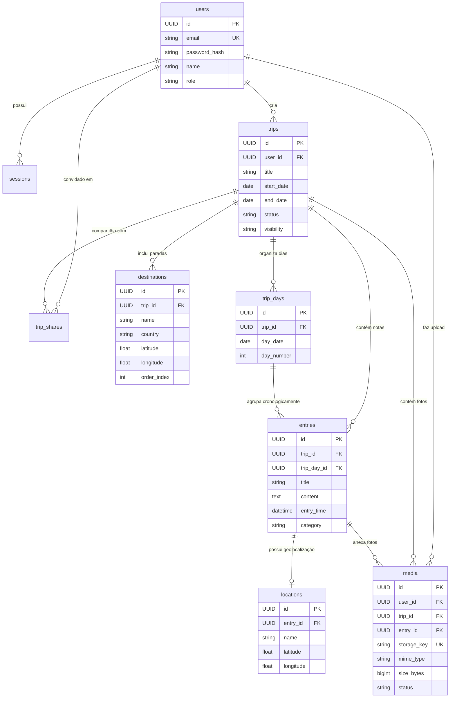

# Relacionamentos e Cardinalidade — Diário de Viagens

Este documento descreve as relações entre as entidades do banco de dados, integridade referencial e diagramas ER.

---

## 1. Diagrama de Entidade-Relacionamento (ER)

---

## 2. Cardinalidades Detalhadas

| Relação | Cardinalidade | Comportamento `ON DELETE` | Justificativa de Negócio |
| :--- | :---: | :--- | :--- |
| `users` → `trips` | **1 : N** | `CASCADE` | Se um usuário for excluído, todas as suas viagens são apagadas |
| `users` → `sessions` | **1 : N** | `CASCADE` | Sessões são invalidadas imediatamente na exclusão do usuário |
| `trips` → `destinations` | **1 : N** | `CASCADE` | Destinos pertencem ao itinerário exclusivo daquela viagem |
| `trips` → `trip_days` | **1 : N** | `CASCADE` | Dias são subdivisões temporais da viagem |
| `trips` → `entries` | **1 : N** | `CASCADE` | As notas de diário pertencem ao contexto da viagem |
| `trip_days` → `entries` | **1 : N** | `SET NULL` | Se um dia for removido, as entradas não são perdidas; voltam a ficar desassociadas |
| `entries` → `locations` | **1 : 1** | `CASCADE` | A coordenada geográfica é atributo direto daquela entrada |
| `entries` → `media` | **1 : N** | `SET NULL` | A foto permanece salva na galeria da viagem mesmo se o relato for excluído |
| `trips` → `trip_shares` | **1 : N** | `CASCADE` | Convites e compartilhamentos deixam de existir se a viagem for removida |

---

## 3. Política de Exclusão: Hard Delete vs Soft Delete

* **Hard Delete (`DELETE CASCADE`)**:
  - `sessions`: Excluídas fisicamente para não inflar a tabela de autenticação.
  - `locations`: Coordenadas de entradas apagadas são removidas fisicamente.
* **Soft Delete (`deleted_at`)**:
  - `users`: Preserva histórico para integridade de auditoria.
  - `trips` e `entries`: Recebem timestamp em `deleted_at`. Permite que o usuário desfaça exclusões acidentais na interface (*Undo / Lixeira*) por até 30 dias antes da limpeza definitiva.
