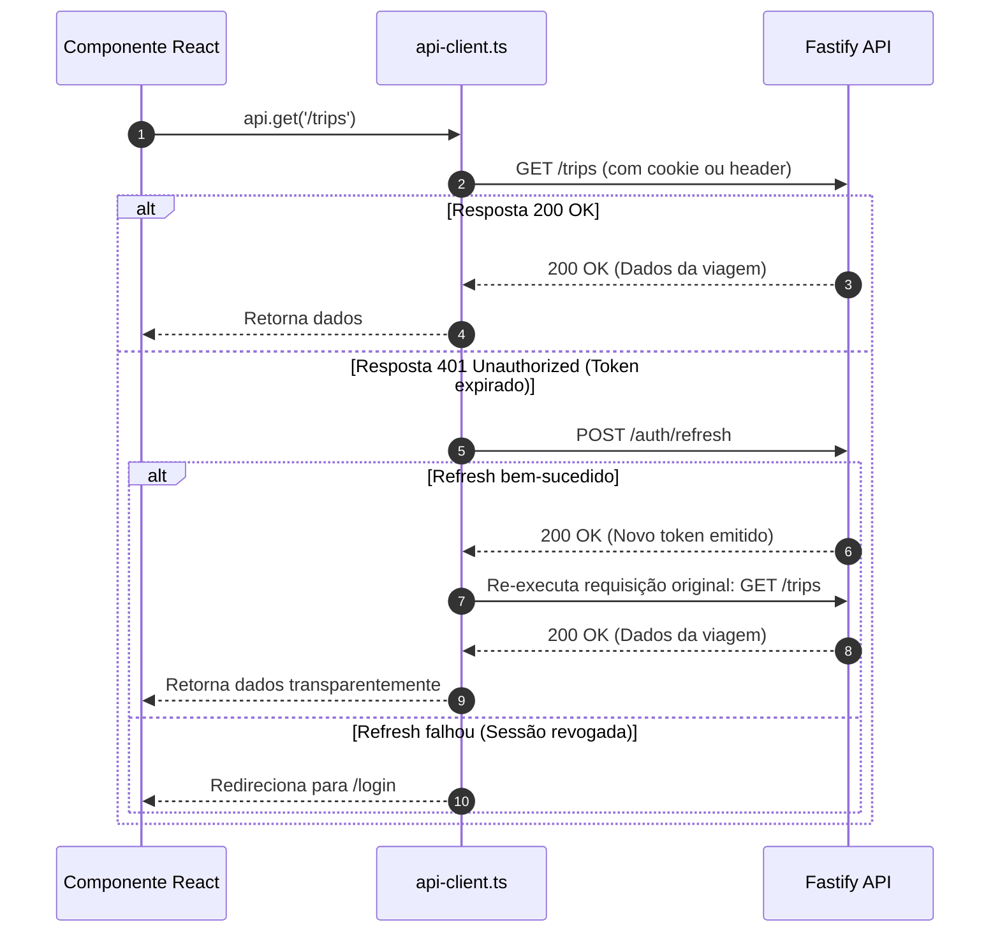

# Arquitetura do Frontend Web — Diário de Viagens

Este documento detalha o design de software, organização de diretórios e padrões arquiteturais do frontend construído com **Next.js (App Router)**, **TypeScript** e **Tailwind CSS**.

---

## 1. Arquitetura Modular Baseada em Features

Para evitar a desordem comum de pastas genéricas como `components/` com dezenas de arquivos desconexos, o frontend adota a arquitetura **Feature-Driven**:

```text
apps/web/src/
├── app/                        # App Router (Apenas rotas, layouts e páginas)
│   ├── (auth)/                 # Grupo de rotas públicas de autenticação (login, cadastro)
│   ├── (dashboard)/            # Grupo de rotas autenticadas do usuário
│   │   ├── trips/
│   │   │   ├── page.tsx        # Listagem de viagens
│   │   │   ├── new/page.tsx    # Formulário de criação de viagem
│   │   │   └── [id]/
│   │   │       ├── page.tsx    # Detalhes da viagem (Timeline e Mapa)
│   │   │       └── edit/page.tsx
│   │   └── profile/page.tsx
│   ├── layout.tsx              # Root Layout com provedores globais
│   └── page.tsx                # Landing page informativa
│
├── features/                   # Domínios de negócio autocontidos
│   ├── auth/
│   │   ├── components/         # LoginForm, RegisterForm
│   │   ├── hooks/              # useAuth, useLoginMutation
│   │   ├── services/           # auth.api.ts
│   │   └── types/              # Tipos específicos da UI de autenticação
│   ├── trips/
│   │   ├── components/         # TripCard, TripList, TripHeader, TripStatusBadge
│   │   ├── hooks/              # useTripsQuery, useCreateTripMutation
│   │   └── services/           # trips.api.ts
│   ├── entries/
│   │   ├── components/         # EntryTimelineItem, EntryModal, MarkdownEditor
│   │   └── hooks/              # useTimelineQuery, useCreateEntryMutation
│   ├── media/
│   │   ├── components/         # PhotoGallery, DirectImageUploader, MediaLightbox
│   │   └── hooks/              # useDirectUpload
│   └── map/
│       ├── components/         # InteractiveMap, RoutePolyline, LocationMarker
│       └── hooks/              # useMapBounds
│
├── components/                 # Componentes genéricos de UI (Design System Primitives)
│   ├── ui/                     # Button, Input, Modal, Dropdown, Skeleton, Badge
│   └── layout/                 # Navbar, Sidebar, Footer, Container
│
├── lib/                        # Utilitários de infraestrutura
│   ├── api-client.ts           # Cliente HTTP configurado com interceptores e refresh
│   └── utils.ts                # Funções utilitárias (cn, formatação de datas)
│
└── providers/                  # React Context Providers (QueryClientProvider, AuthProvider)
```

---

## 2. Server Components vs Client Components

* **React Server Components (RSC)**: Utilizados por padrão para páginas, layouts estáticos, metadados SEO e recuperação inicial de dados em páginas públicas ou compartilhadas. Reduz o tamanho do bundle JavaScript enviado ao navegador.
* **Client Components (`'use client'`)**: Reservados exclusivamente para componentes que exigem interatividade:
  - Formulários com validação instantânea (`react-hook-form` + Zod).
  - Componentes de mapa interativo (Leaflet / MapLibre).
  - Upload direto de fotos com barra de progresso.
  - Modais interativos e dropdowns.

---

## 3. Cliente HTTP e Interceptor de Autenticação (`api-client.ts`)

O cliente HTTP utiliza a `Fetch API` nativa encapsulada com tratamento inteligente de erros e renovação automática de token:


