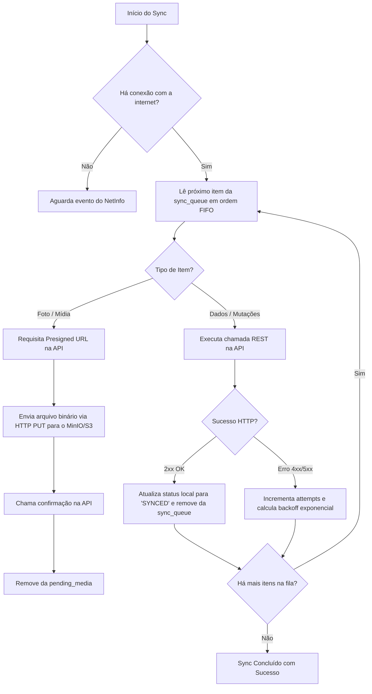

# Estratégia de Sincronização Offline-First — Diário de Viagens

Este documento detalha o funcionamento do motor de sincronização offline, schema do SQLite local, fila de mutações e reconciliação de dados.

---

## 1. Princípio Fundamental

No aplicativo mobile, a **persistência local é a fonte primária da verdade para a UI**. O usuário nunca fica bloqueado aguardando uma resposta de rede para interagir com o app.

---

## 2. Schema do Banco de Dados Local (SQLite)

O SQLite armazena réplicas locais dos dados do usuário enriquecidas com metadados de sincronização:

```sql
-- Viagens salvas localmente
CREATE TABLE local_trips (
    id TEXT PRIMARY KEY,               -- UUIDv7 gerado no app ou servidor
    title TEXT NOT NULL,
    description TEXT,
    start_date TEXT NOT NULL,
    end_date TEXT,
    status TEXT NOT NULL,
    sync_status TEXT NOT NULL,          -- 'SYNCED', 'PENDING_CREATE', 'PENDING_UPDATE', 'PENDING_DELETE'
    updated_at INTEGER NOT NULL         -- Timestamp Unix em milissegundos
);

-- Entradas de diário locais
CREATE TABLE local_entries (
    id TEXT PRIMARY KEY,
    trip_id TEXT NOT NULL,
    title TEXT,
    content TEXT NOT NULL,
    entry_date TEXT NOT NULL,
    category TEXT NOT NULL,
    latitude REAL,
    longitude REAL,
    location_name TEXT,
    sync_status TEXT NOT NULL,
    updated_at INTEGER NOT NULL
);

-- Fila de ações pendentes (Sync Queue)
CREATE TABLE sync_queue (
    id INTEGER PRIMARY KEY AUTOINCREMENT,
    entity_type TEXT NOT NULL,          -- 'TRIP', 'ENTRY', 'MEDIA'
    entity_id TEXT NOT NULL,
    action TEXT NOT NULL,               -- 'CREATE', 'UPDATE', 'DELETE'
    payload TEXT NOT NULL,              -- JSON serializado com os dados da operação
    attempts INTEGER DEFAULT 0,
    last_error TEXT,
    created_at INTEGER NOT NULL
);

-- Fila de fotos aguardando upload
CREATE TABLE pending_media (
    id TEXT PRIMARY KEY,
    entry_id TEXT NOT NULL,
    local_file_uri TEXT NOT NULL,       -- Caminho do arquivo no sistema de arquivos do celular
    mime_type TEXT NOT NULL,
    size_bytes INTEGER NOT NULL,
    status TEXT NOT NULL,               -- 'PENDING_UPLOAD', 'UPLOADING', 'FAILED', 'COMPLETED'
    created_at INTEGER NOT NULL
);
```

---

## 3. O Ciclo do Motor de Sincronização (`SyncEngine`)

O `SyncEngine` é acionado em três ocasiões:
1. Ao abrir o aplicativo.
2. Quando a biblioteca `@react-native-community/netinfo` detecta que a conexão de rede mudou de offline para online.
3. Manualmente, quando o usuário puxa a tela para baixo (*pull-to-refresh*).

### 3.1 Algoritmo de Execução da Fila:


---

## 4. Resolução de Conflitos (Last Write Wins)

Se o usuário editar uma entrada no celular enquanto estiver sem internet e também tiver alterado o texto via web:
1. O backend compara o campo `updated_at` (em milissegundos UTC) enviado na requisição com o registro do banco.
2. A alteração com o timestamp mais recente é aceita (*Last Write Wins*).
3. Na próxima sincronização de leitura, o app mobile baixa a versão final consolidada do servidor.
